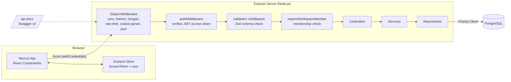
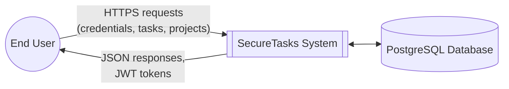
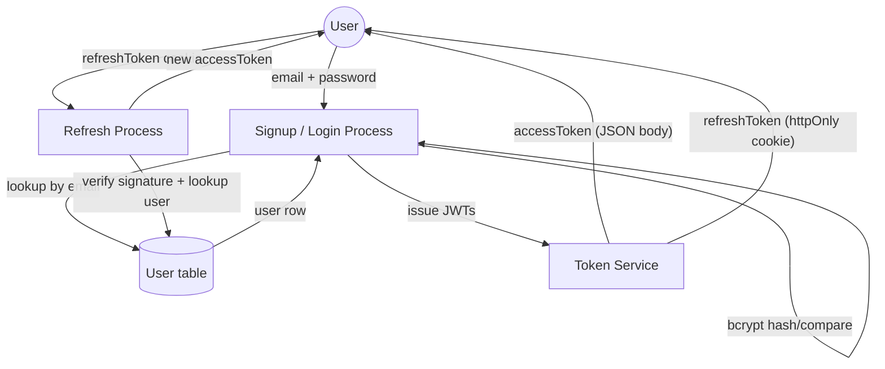
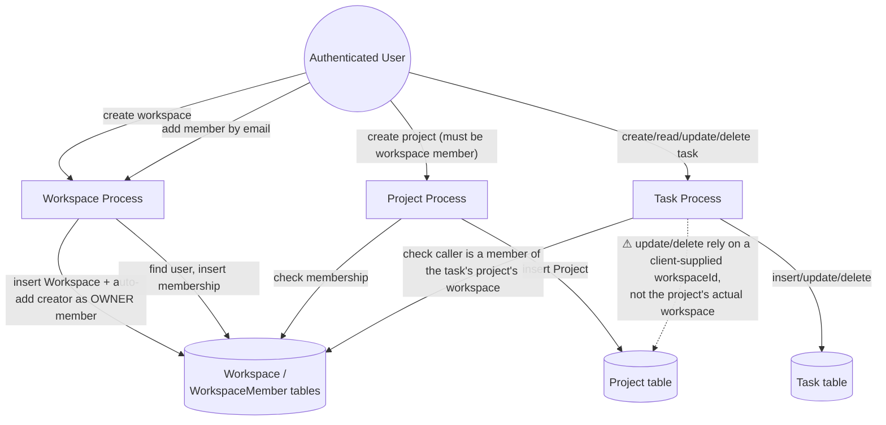
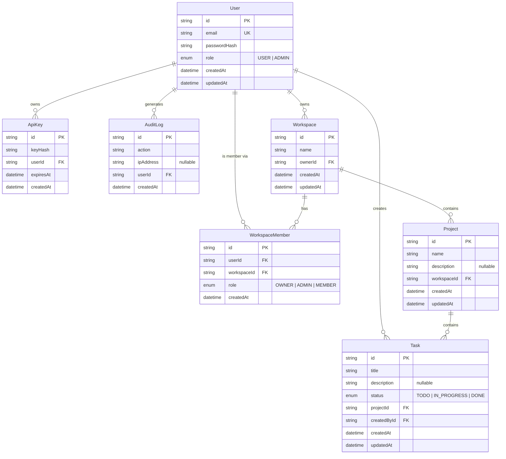
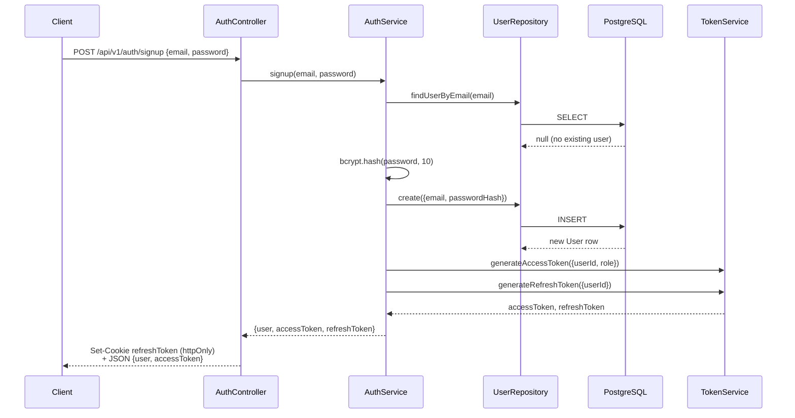

# SecureTasks — Knowledge Transfer Report

> Written for the next engineer taking over this codebase. Read this top to bottom once, then use it as a reference. It covers what the system does, how every layer works, every API, the database, and — importantly — the rough edges and unfinished parts you'll inherit.

---

## 1. What is SecureTasks?

SecureTasks is a **task management platform** (think a stripped-down Jira/Asana), built as a learning project for production-style, full-stack engineering patterns: JWT auth, RBAC, layered backend architecture, and a typed frontend.

The domain model is simple:

- A **User** signs up and logs in.
- A User creates/owns **Workspaces** (like a "team" or "org").
- A Workspace has **Members** (Owner / Admin / Member roles).
- A Workspace contains **Projects**.
- A Project contains **Tasks**.

**Update (2026-08-14): the frontend is now wired end-to-end.** Auth, Workspaces, Projects, and Tasks all have real screens backed by the real API — landing page, dashboard, a drag-and-drop Kanban task board, task detail, a projects grid, and a workspaces/members page. See [Section 8](#8-current-state--whats-actually-done) for the current honest breakdown, and the new [Section 12](#12-changelog-since-2026-08-10) for exactly what changed since this report was first written.

---

## 2. Tech Stack

| Layer | Technology |
|---|---|
| Frontend framework | Next.js 16 (App Router), React 19, TypeScript |
| Frontend state | Zustand (with `persist` middleware → localStorage) — `auth.store.ts`, `workspace.store.ts` (active workspace selection) |
| Frontend data-fetching | TanStack Query (React Query) — used for real queries/mutations in every feature (`features/*/hooks/use-*.ts`) |
| Frontend forms | react-hook-form + Zod resolvers |
| Frontend styling | Tailwind CSS v4, dark/light theme via CSS variables + `data-theme` attribute (see §7.6) |
| Frontend drag-and-drop | `@dnd-kit/core`, `@dnd-kit/sortable`, `@dnd-kit/utilities` — used for the Kanban task board |
| Frontend HTTP client | Axios (`lib/api.ts`) — request interceptor attaches the JWT; response interceptor does a silent `POST /auth/refresh` + retry on 401 (see §7.6) |
| Backend runtime | Node.js + Express 5 |
| Backend language | TypeScript (via `ts-node-dev` in dev) |
| ORM | Prisma 6 |
| Database | PostgreSQL |
| Auth | JWT (access + refresh tokens) via `jsonwebtoken`, passwords hashed with `bcrypt` |
| Validation | Zod (both frontend and backend schemas) |
| API docs | Swagger / OpenAPI 3.0 (`swagger-jsdoc` + `swagger-ui-express`), served at `/api-docs` |
| Security middleware | `helmet`, `cors`, `express-rate-limit`, `cookie-parser` |
| Logging | `morgan` (HTTP access log) + a custom (currently unused) `loggerMiddleware` |
| Monorepo layout | `apps/client`, `apps/server`, `packages/shared-types` (empty, unused today) |

There is **no test suite** anywhere in the repo (server `package.json` test script is a placeholder stub). There is **no CI/CD config** present in the repo.

---

## 3. Repository Structure

```
SecureTasks/
├── apps/
│   ├── client/                     # Next.js frontend
│   │   └── src/
│   │       ├── app/                # App Router pages (landing, login, signup, dashboard/*)
│   │       ├── components/auth/    # ProtectedRoute wrapper (+ idle-logout hook, see §7.6)
│   │       ├── components/layout/  # DashboardShell (top nav, workspace switcher, notif bell, theme toggle)
│   │       ├── components/ui/      # Small local UI kit (Button, Card, Badge, Dialog, Tabs, ...) — no shadcn/radix
│   │       ├── features/           # tasks / projects / workspace — hooks/ (React Query) + components/
│   │       ├── hooks/               # use-theme.ts, use-idle-logout.ts
│   │       ├── lib/api.ts          # Axios instance + auth header interceptor + silent-refresh-on-401 interceptor
│   │       ├── providers/          # React Query provider
│   │       ├── services/           # API call wrappers — all four (auth/task/project/workspace) implemented
│   │       ├── store/               # Zustand: auth.store.ts, workspace.store.ts (active workspace)
│   │       └── types/               # task/project/workspace TS types
│   └── server/                     # Express backend
│       └── src/
│           ├── config/             # env validation, prisma client, rate limit, swagger (dead file, see §9)
│           ├── docs/swagger/       # Hand-written OpenAPI path/schema definitions (this is what's actually served)
│           ├── generated/prisma/   # Prisma Client output (auto-generated, do not edit)
│           ├── middleware/         # auth, role, validation, workspace-membership, error, logger
│           ├── modules/
│           │   ├── task/           # Auth AND Task modules both live here (see §9 naming note)
│           │   ├── projects/
│           │   └── workspace/
│           ├── utils/              # AppError class, asyncHandler wrapper
│           └── server.ts           # App entrypoint — wires everything together
├── packages/
│   └── shared-types/               # Empty — intended for FE/BE shared TS types, unused so far
└── docs/                           # This documentation
    ├── api/                        # Per-endpoint docs (partially filled in)
    ├── architecture/               # High-level architecture notes (partially filled in)
    └── setup/                      # Local dev / env / Prisma / Postgres setup guides
```

Each backend module (`task`, `projects`, `workspace`) follows the same **layered pattern**:

```
routes/  →  controllers/  →  services/  →  repositories/  →  Prisma  →  PostgreSQL
```

- **routes** — wire up URL + HTTP method + middleware chain + controller method.
- **controllers** — read `req`, call the service, shape the HTTP response. Should have no business logic.
- **services** — business logic, validation of business rules (e.g. "does this task belong to this user"), orchestration.
- **repositories** — the only layer that talks to Prisma / the database directly.

This is a clean, conventional pattern — if you're adding a new resource, copy this shape.

---

## 4. High-Level Architecture (HLD)



**Request path in words:** Browser → Axios (attaches `Authorization: Bearer <accessToken>` header + sends `refreshToken` httpOnly cookie automatically) → Express global middleware → route-specific middleware (auth check → input validation → workspace-membership check, in that order where applicable) → Controller → Service → Repository → Prisma → PostgreSQL, and the response travels back up the same chain.

---

## 5. Data Flow Diagrams (DFD)

### 5.1 Level-0 DFD (Context Diagram)



### 5.2 Level-1 DFD — Authentication



### 5.3 Level-1 DFD — Workspace → Project → Task Hierarchy



Task visibility/authorization is now workspace-membership-based end to end (fixed — see [Section 12](#12-changelog-since-2026-08-10)). The remaining dotted line flags a *different*, still-open issue on the Project update/delete path — see finding **#4** in [Section 9](#9-known-issues--tech-debt-read-before-you-touch-this).

---

## 6. Database Design

### 6.1 Entity-Relationship Diagram



### 6.2 Notes on the schema

- All primary keys are UUID strings (`@default(uuid())`), not auto-increment ints.
- `WorkspaceMember` has a composite uniqueness constraint on `(userId, workspaceId)` — a user can't join the same workspace twice.
- **`ApiKey` and `AuditLog` tables exist in the schema and in migrations, but there is zero application code (no repository, service, controller, or route) that reads or writes them.** These were scaffolded for the "API Keys" and "Audit Logs" features listed in the README but never implemented. If you're picking up one of those features, the DB side is already there.
- DB handling is 100% through **Prisma ORM** — no raw SQL anywhere in the app code. Prisma Client is generated into `apps/server/src/generated/prisma/` (checked into the repo, regenerate with `npx prisma generate` if the schema changes and it looks stale).
- Migrations live in `apps/server/prisma/migrations/`. There are two so far: `init` (User/Task/ApiKey/AuditLog) and `add_workspaces_projects` (Workspace/WorkspaceMember/Project). To create a new one: `npx prisma migrate dev --name <name>`.

---

## 7. Low-Level Design (LLD) — Per Module

### 7.1 Auth Module (`apps/server/src/modules/task/` — yes, it lives under the `task` folder, see §9)

**Files:** `controllers/auth.controllers.ts`, `services/auth.services.ts`, `services/token.services.ts`, `repositories/user.repositories.ts`, `routes/auth.routes.ts`

**Sequence — Signup:**



**Login** follows the same shape but calls `bcrypt.compare()` against the stored hash instead of hashing a new one.

**Refresh:** client sends the httpOnly `refreshToken` cookie (browser does this automatically) → server verifies it with `JWT_REFRESH_SECRET`, looks up the user by the `userId` in the payload, and issues a **new access token only** (refresh token is not rotated).

**Logout:** just clears the `refreshToken` cookie. There's no server-side token blacklist/revocation — a refresh token remains valid (per its expiry) even after "logout" if somehow replayed, since nothing is stored server-side to invalidate it. Purely a cookie-clearing convenience, not a security control.

**JWT payload shapes:**
- Access token: `{ userId, role }`, signed with `JWT_ACCESS_SECRET`, expiry = `ACCESS_TOKEN_EXPIRY` env var.
- Refresh token: `{ userId }`, signed with `JWT_REFRESH_SECRET`, expiry = `REFRESH_TOKEN_EXPIRY` env var.

**Endpoints:**

| Method | Path | Auth required | Body |
|---|---|---|---|
| POST | `/api/v1/auth/signup` | No | `{ email, password }` |
| POST | `/api/v1/auth/login` | No | `{ email, password }` |
| POST | `/api/v1/auth/refresh` | No (cookie-based) | none |
| POST | `/api/v1/auth/logout` | No | none |

Note: signup/login controllers do **not** run through the Zod `validate()` middleware — they read `req.body` directly and only Zod-validate on the frontend. Malformed input (e.g. missing password) fails deeper inside (bcrypt/Prisma) rather than with a clean 400.

### 7.2 Task Module (`apps/server/src/modules/task/`)

**Files:** `controllers/task.controllers.ts`, `services/task.services.ts`, `repositories/task.repositories.ts`, `validator/task.validator.ts`, `routes/task.routes.ts`

| Method | Path | Middleware chain | Notes |
|---|---|---|---|
| POST | `/api/v1/tasks` | auth | Creates task, `createdById` = current user. Service verifies the caller is a member of the target project's workspace (404 if project doesn't exist, 403 if not a member) |
| GET | `/api/v1/tasks` | auth | Paginated (`page`, `limit`), optional `status` and `workspaceId` query filters |
| GET | `/api/v1/tasks/:id` | auth | Visible to any member of the task's project's workspace (403 if not a member) |
| PATCH | `/api/v1/tasks/:id` | auth → validate(updateTaskSchema) | Same workspace-membership check |
| DELETE | `/api/v1/tasks/:id` | auth | Same workspace-membership check |

**Visibility model (changed 2026-08-14):** tasks used to be visible only to the user who created them (`createdById === req.user.userId`) — meaning a teammate in the same project could never see a task someone else created. This is now **workspace-membership-based**: `TaskRepository.findVisibleToUser` filters on `project.workspace.members.some({ userId })`, and `TaskService.getTaskById` (which gates read/update/delete) checks a `WorkspaceMember` row instead of `createdById`. `TaskService.createTask` now also checks membership before allowing the insert — previously any authenticated user could create a task against *any* `projectId`, including ones outside their workspace, as long as they knew/guessed the ID.

Update/Delete both call `getTaskById` first to piggyback on the membership check — a nice reuse pattern worth keeping if you extend this module.

~~⚠️ Runtime bug: `TaskRepository.findByUserId()` queried a non-existent `userId` field~~ — **fixed.** The repository method was renamed `findVisibleToUser` and now queries through the `project.workspace.members` relation (`apps/server/src/modules/task/repositories/task.repositories.ts`).

### 7.3 Workspace Module (`apps/server/src/modules/workspace/`)

| Method | Path | Middleware chain | Notes |
|---|---|---|---|
| POST | `/api/v1/workspaces` | auth → validate(createWorkspaceSchema) | Creator is auto-added as a member with role `OWNER` |
| GET | `/api/v1/workspaces` | auth | Lists workspaces the current user is a member of |
| POST | `/api/v1/workspaces/:workspaceId/members` | auth → requireWorkspaceMember → validate(addMemberSchema) | Adds a member **by email**, role `ADMIN` or `MEMBER` |
| GET | `/api/v1/workspaces/:workspaceId/members` | auth → requireWorkspaceMember | Lists members with `{id, email}` |

`requireWorkspaceMember` (middleware, `apps/server/src/middleware/workspace.middleware.ts`) only checks that **a membership row exists** for `(workspaceId, userId)` — it does **not** distinguish OWNER/ADMIN/MEMBER. So today, any member of a workspace — including a plain `MEMBER` — can add other members. The `WorkspaceRole` enum exists in the schema but is not enforced anywhere at the permission-check level.

**Invite bug fixed (2026-08-14):** `WorkspaceService.addMember` used to look up the invitee with `prisma.user.findUnique({ where: { id: userId } })`, but the value passed in from the controller is the invitee's **email**, not their `id` — so the lookup could never match a real user and every invite failed with a 404 "User not found," regardless of whether the email belonged to a real account. Fixed to query `where: { email }`. While in there, also added a pre-insert check that throws a clean `409 "User is already a member of this workspace"` instead of letting the underlying `@@unique([userId, workspaceId])` constraint surface as an unhandled 500.

### 7.4 Project Module (`apps/server/src/modules/projects/`)

| Method | Path | Middleware chain | Notes |
|---|---|---|---|
| POST | `/api/v1/projects` | auth → requireWorkspaceMember → validate(createProjectSchema) | `workspaceId` comes from body |
| GET | `/api/v1/projects/workspace/:workspaceId` | auth → requireWorkspaceMember | Lists projects for a workspace |
| PATCH | `/api/v1/projects/:projectId` | auth → requireWorkspaceMember | ⚠ no `validate()` on update — body isn't Zod-checked despite `updateProjectSchema` existing |
| DELETE | `/api/v1/projects/:projectId` | auth → requireWorkspaceMember | — |

Note `requireWorkspaceMember` reads `workspaceId` from `req.params.workspaceId || req.body.workspaceId`. For the update/delete routes, the URL only has `:projectId`, not `:workspaceId` — meaning the membership check on those two routes effectively falls through to `req.body.workspaceId`, which the client isn't required to send.

⚠️ **This is now reachable, not just theoretical — worth fixing soon.** The client (`apps/client/src/services/project.service.ts`) was updated on 2026-08-14 to always send `workspaceId` in the PATCH/DELETE body, because without it the request 403'd unconditionally and editing/deleting a project didn't work at all. That made the feature usable, but it also means the underlying gap is now live: `requireWorkspaceMember` only checks *"is the caller a member of the workspace named in the body"* — it never cross-checks that this `workspaceId` actually matches `project.workspaceId`. So a user who is a member of Workspace A (any workspace they belong to) can PATCH or DELETE a project that actually belongs to Workspace B, as long as they know the project's ID and pass their own `workspaceId` in the body. Neither `ProjectService.updateProject`/`deleteProject` nor the repository layer verify the project belongs to the workspace being checked. This is finding **#4** in [Section 9](#9-known-issues--tech-debt-read-before-you-touch-this) — the real fix is to derive the workspace from the project record server-side (`prisma.project.findUnique({ where: { id: projectId } }).workspaceId`) instead of trusting a client-supplied `workspaceId`.

### 7.5 Middleware Reference

| Middleware | File | Purpose |
|---|---|---|
| `authMiddleware` | `middleware/auth.middleware.ts` | Reads `Authorization: Bearer <token>`, verifies with `JWT_ACCESS_SECRET`, attaches `req.user = {userId, role}` |
| `requiredRole(role)` | `middleware/role.middleware.ts` | Global RBAC gate — checks `req.user.role === role`. Only wired up on the demo `/admin` route in `server.ts`, not used in any real module today |
| `requireWorkspaceMember` | `middleware/workspace.middleware.ts` | Confirms the caller has a `WorkspaceMember` row for the target workspace; attaches `req.workspaceMember` |
| `validate(schema)` | `middleware/validation.middleware.ts` | Runs a Zod schema against `req.body`, replaces `req.body` with the parsed/typed result, returns 400 with flattened Zod errors on failure |
| `errorMiddleware` | `middleware/error.middleware.ts` | Final error handler — formats `AppError` instances with their `statusCode`, otherwise 500. Registered last, after all routes |
| `asyncHandler` | `utils/async-handler.ts` | Wraps async controller methods so thrown/rejected errors reach `errorMiddleware` instead of crashing the process |
| `apiRateLimiter` | `config/rate-limit.ts` | Global, applied to the **entire app** (not just `/api/*`). Limit is now `RATE_LIMIT_MAX` (env, optional) or a default of 2000/15min in dev, 300/15min in production — was a hardcoded 100/15min, which was blowing up during normal dev usage (React Query refetches + manual testing routinely exceeded it, locking out the dev's own IP) |
| `loggerMiddleware` | `middleware/logger.middleware.ts` | A custom request-duration logger — written but **never registered** in `server.ts` (morgan is used instead) |

**Note on error handling consistency:** the Task/Workspace/Project modules mostly rely on `asyncHandler` + `AppError` + the global `errorMiddleware` (clean pattern). The Auth module's controllers instead use manual `try/catch` blocks with their own `res.status(400/401).json(...)` calls, bypassing `AppError`/`errorMiddleware` entirely. Both work, but it's an inconsistency — pick one pattern if you refactor.

### 7.6 Frontend Structure (`apps/client/src/`) — new since 2026-08-10

The frontend went from "auth only" to wired-up screens for every core resource. No design system library (no shadcn/radix) — there's a small hand-rolled `components/ui/` kit (`Button`, `Card`, `Badge`, `Avatar`, `Input`, `Textarea`, `Dialog`, `Tabs`, `Skeleton`) built on Tailwind + a `cn()` helper (`lib/utils.ts`, `clsx` + `tailwind-merge`).

**Pages (`app/`):**

| Route | What's there |
|---|---|
| `/` | Marketing landing page (hero, feature bento, pricing, testimonial) |
| `/login`, `/signup` | Restyled with the UI kit, same auth logic as before |
| `/dashboard` | Home: "Today's Focus" (real tasks), AI-suggestion card (static placeholder), Sprint Health/Deadlines (static), Team Status (real — pulls workspace members), Recent Activity (real) |
| `/dashboard/tasks` | Kanban board — TODO / IN_PROGRESS / DONE columns, drag-and-drop via `@dnd-kit` to change status, "New task" dialog |
| `/dashboard/tasks/[id]` | Task detail — editable title/description, editable status, delete button; Subtasks/Comments/AI Summary/Assignee/Time-tracked are static "coming soon" placeholders (no backing data model yet — see `Task` in §6) |
| `/dashboard/projects` | Projects grid — hero card + list, scoped to the active workspace, create/delete |
| `/dashboard/workspaces` | List/select/create workspaces, invite members by email, list members with role |

**State/data layer:**

- `store/auth.store.ts` — unchanged (existing).
- `store/workspace.store.ts` — **new.** Persists the "active workspace" selection to localStorage; most feature hooks (`useTasks`, `useProjects`, etc.) key their React Query cache and API calls off this.
- `features/{tasks,projects,workspace}/hooks/use-*.ts` — React Query hooks (list/detail queries + create/update/delete mutations) wrapping the now-implemented `services/*.service.ts` files. `useUpdateTask` does an optimistic update so drag-and-drop on the Kanban board feels instant.
- `lib/api.ts` — **response interceptor added.** On any `401`, it calls `POST /auth/refresh` once (de-duped across concurrent requests via a shared in-flight promise) and retries the original request; if the refresh call itself fails, it logs out and redirects to `/login`. This means an *active* user's session survives past the 15-minute access-token expiry without them noticing.
- `hooks/use-idle-logout.ts` — **new, separate from the above.** Tracks mouse/keyboard/touch/scroll activity; after 15 minutes with **zero** activity, force-logs-out and redirects regardless of token validity. Wired into `ProtectedRoute`. So: active users get silently refreshed; idle users get kicked, even though a refresh would otherwise have kept them logged in.
- `hooks/use-theme.ts` + `components/theme-toggle.tsx` — light/dark toggle. Theme is a `data-theme` attribute on `<html>` + a small `useSyncExternalStore` hook (chosen over `useState`+`useEffect` specifically to avoid a hydration-mismatch/flash-of-wrong-theme, since the theme is read from `localStorage`, an external source React doesn't own). An inline script in `app/layout.tsx` sets the attribute before first paint.
- Notification bell (`components/layout/dashboard-shell.tsx`) — currently a static "No new notifications" dropdown placeholder; there's no notifications data model or backend endpoint yet.

---

## 8. Current State — What's Actually Done

Be direct with yourself about this before estimating any new work:

| Area | Status |
|---|---|
| Signup / Login (backend) | ✅ Complete and working |
| Signup / Login (frontend) | ✅ Complete — forms call the real API, store the token, redirect to `/dashboard`, restyled with the UI kit |
| Refresh / Logout (backend) | ✅ Complete |
| Refresh / Logout (frontend) | ✅ Silent-refresh-on-401 Axios interceptor + idle-based (15 min) auto-logout + a working logout action in the dashboard header (see §7.6) |
| Task CRUD (backend) | ✅ `findByUserId` bug fixed; visibility model changed from creator-only to workspace-membership-based; `createTask` now checks membership |
| Task CRUD (frontend) | ✅ Kanban board with drag-and-drop, task detail page, create/update/delete all wired to the real API |
| Workspace CRUD + membership (backend) | ✅ Functionally complete; **invite bug fixed** (was always 404ing, see §7.3); duplicate-invite now a clean 409. Permission caveat in §7.3 (role not enforced) still open |
| Workspace CRUD (frontend) | ✅ List/select/create workspaces, invite members, list members with role |
| Project CRUD (backend) | ⚠️ Routes are now mounted (previously **not mounted at all** — see §12) and functional, but see the update/delete authorization gap in §7.4 and finding #4 |
| Project CRUD (frontend) | ✅ Projects grid, create/delete wired to the real API |
| API Keys feature | ❌ DB table only, no application code |
| Audit Logs feature | ❌ DB table only, no application code |
| Swagger docs | ✅ Served at `/api-docs`, now covers Auth, Task, Workspace (incl. the members endpoints, previously undocumented), a brand-new Projects section (previously undocumented entirely), and "System" — hand-written (not JSDoc-generated, despite a leftover file that suggests otherwise, see §9). One pre-existing doc/route mismatch remains — see §9 item 15 |
| Tests | ❌ None |
| `packages/shared-types` | ❌ Empty — presumably meant to hold types shared between `apps/client` and `apps/server` |

**In short: both the backend and frontend are now functionally complete for the core CRUD hierarchy (workspace → project → task) and their happy paths work end-to-end in the browser. What's left is mostly hardening (the auth/authorization gaps in §9), not building — plus the two genuinely unbuilt features (API Keys, Audit Logs) and anything the task-detail UI currently shows as a placeholder (subtasks, comments, assignee, time tracking — none of which exist in the data model yet).**

---

## 9. Known Issues / Tech Debt (read before you touch this)

Ordered roughly by how much it'll bite you. Items fixed since the last version of this report are kept (struck through) rather than deleted, so you can see what changed.

1. ~~`GET /api/v1/tasks` will throw at runtime (`userId`/`createdById` mismatch).~~ **Fixed 2026-08-14** — see §7.2.

2. **`GET /health` leaks all user records, including `passwordHash`, with no auth check.** Still present — not touched this round. It's a debug leftover (`app.get("/health", ...)` in `server.ts` calls `prisma.user.findMany()` and returns it directly). Fix before any real deployment — either remove the user dump or gate it behind auth, and never return `passwordHash`.

3. ~~Task creation doesn't verify workspace membership.~~ **Fixed 2026-08-14** — `TaskService.createTask` now checks the caller is a member of the target project's workspace before inserting (404 if the project doesn't exist, 403 if not a member). See §7.2.

4. **Project update/delete don't reliably enforce workspace membership — now the top item to fix.** See the expanded writeup in §7.4. Previously this route effectively 403'd for everyone (since nothing sent `workspaceId`), so it was broken-but-safe. The client was updated to send `workspaceId` in the body to make the feature work, which makes the endpoint usable — but the server still never validates that the supplied `workspaceId` is the *project's actual* workspace, so any workspace member can now update/delete a project belonging to a workspace they aren't part of, as long as they know the project ID. This moved from "broken" to "reachable authorization bypass" and should be near the top of the list for whoever picks this up next.

5. **`WorkspaceRole` (OWNER/ADMIN/MEMBER) is unused for authorization.** Still open. Any member — regardless of role — can add other members, list members, create/update/delete projects. If tiered permissions are actually a requirement, this needs a new middleware (e.g. `requireWorkspaceRole(["OWNER","ADMIN"])`) similar to how `requiredRole` works for global roles.

6. **`express.json()` is registered twice** in `server.ts`. Still present — harmless but redundant, remove one.

7. **Refresh-token cookie has `secure: false` hardcoded** and no explicit `maxAge`/`expires`, so it behaves as a session cookie in the browser regardless of `REFRESH_TOKEN_EXPIRY`. Still present. Needs `secure: true` behind HTTPS in production, and an explicit `maxAge` matching the JWT expiry.

8. **`apps/server/src/config/swagger.ts` is dead code.** Still present, not touched. The app actually imports its Swagger spec from `apps/server/src/docs/swagger/swagger.ts` (hand-assembled path/schema objects, now covering Auth/Task/Workspace incl. members/Projects/System — see §7 and §12). `config/swagger.ts` is an older JSDoc-glob-based approach that's no longer wired into `server.ts` — safe to delete once confirmed unused, or clearly mark as legacy.

9. **Module naming is misleading:** the Auth module's code (controllers/services/routes for signup/login/refresh/logout) lives inside `apps/server/src/modules/task/`, alongside the actual Task module. Still true. If you're hunting for auth code expecting a `modules/auth/` folder, it isn't there — it's `modules/task/controllers/auth.controllers.ts`, `modules/task/services/auth.services.ts`, etc.

10. **Inconsistent error handling style** between Auth (manual try/catch + raw `res.status()`) and Task/Project/Workspace (`asyncHandler` + `AppError` + centralized `errorMiddleware`). Still true. Pick one going forward — the `asyncHandler`/`AppError` pattern is the better one to standardize on.

11. **No refresh-token rotation and no server-side revocation.** Still true — the new frontend silent-refresh flow (§7.6) makes *more* use of `/auth/refresh`, which makes this more relevant, not less. A leaked/stolen refresh token stays valid until it expires; "logout" (both the button and the new 15-minute idle auto-logout) only clears client-side state — the refresh token itself isn't invalidated server-side. If this app ever handles real user data, consider storing refresh-token identifiers (or a token version/family) server-side so they can be invalidated.

12. **Auth endpoints skip Zod validation** — `signup`/`login` controllers read `req.body` directly without running through the `validate()` middleware other modules use. Still true.

13. ~~Frontend service stubs are empty files.~~ **Resolved 2026-08-14** — `task.service.ts`, `project.service.ts`, `workspace.service.ts` are all implemented now, following the `auth.service.ts` pattern. See §7.6 and §12.

14. **`packages/shared-types` is empty.** Still true. If FE/BE type duplication becomes a problem (e.g. `TaskStatus`, response shapes), this is clearly where shared types were meant to go — nothing currently references this package from either app. The client independently redeclares `TaskStatus`, `Task`, `Project`, `Workspace`, etc. under `apps/client/src/types/` — worth reconciling with this package eventually.

15. **New finding: Swagger doc/route path mismatch for `/profile` and `/admin`.** `apps/server/src/docs/swagger/system/system.paths.ts` documents these as `/api/v1/profile` and `/api/v1/admin`, but `server.ts` actually mounts them at `/profile` and `/admin` (no `/api/v1` prefix — they're registered directly on `app`, not through a versioned router). Anyone testing against the documented paths via Swagger UI will get a 404. Not touched this round since it predates and is unrelated to the Task/Workspace/Project doc changes made in §12 — flagging it here since it was noticed while auditing `docs/swagger/`.

16. **New finding: rate limiter is still global, not endpoint-scoped.** The 100→2000(dev)/300(prod) fix in §7.5 raises the ceiling but doesn't change the fact that `apiRateLimiter` applies to literally every route with one shared counter per IP. A more deliberate setup would put a tight limiter on `/auth/login` and `/auth/signup` (brute-force protection, where a low limit is *correct*) and a much looser or no limiter on general CRUD routes — right now one setting has to serve both purposes, which is why it was so easy to get wrong in either direction.

---

## 10. Environment & Setup

### Backend (`apps/server/.env`)

| Variable | Purpose |
|---|---|
| `DATABASE_URL` | PostgreSQL connection string, consumed by Prisma |
| `PORT` | Port the Express server listens on |
| `JWT_ACCESS_SECRET` | Signing secret for access tokens |
| `JWT_REFRESH_SECRET` | Signing secret for refresh tokens |
| `ACCESS_TOKEN_EXPIRY` | e.g. `15m` — passed straight to `jsonwebtoken`'s `expiresIn` |
| `REFRESH_TOKEN_EXPIRY` | e.g. `7d` |
| `RATE_LIMIT_MAX` | Optional. Requests per IP per 15-min window for `apiRateLimiter`. Defaults to 2000 in dev, 300 in production if unset |
| `NODE_ENV` | Optional but read by `rate-limit.ts` to pick the default above — not currently set in `.env` |

Env vars are validated at boot via a Zod schema in `apps/server/src/config/env.ts` — if any are missing, the process logs an error and exits (`process.exit(1)`). Note: the app currently reads `process.env.*` directly in several places (e.g. `auth.middleware.ts`, `token.services.ts`) rather than importing the validated `env` object from `config/env.ts` — worth consolidating so the Zod validation is actually the single source of truth everywhere.

### Frontend (`apps/client/.env`)

| Variable | Purpose |
|---|---|
| `NEXT_PUBLIC_BASE_API_URL` | Base URL the Axios client (`lib/api.ts`) points at, e.g. `http://localhost:5000/api/v1` |

### Running locally

```bash
# Backend
cd apps/server
npm install
npx prisma migrate dev     # applies migrations, generates Prisma Client
npm run dev                # ts-node-dev, watches for changes

# Frontend
cd apps/client
npm install
npm run dev                # next dev
```

Swagger UI: `http://localhost:<PORT>/api-docs`

---

## 11. Suggested Next Steps (priority order)

The original list here is mostly done (frontend built out, `findByUserId` fixed, `/health` leak still open, invite bug fixed). Revised for where things stand now:

1. **Fix the Project update/delete authorization gap (item #4 in §9)** — derive `workspaceId` from the project record server-side instead of trusting the client-supplied body value. This is the most important open item; it's a real, reachable authorization bypass, not just tech debt.
2. Remove or auth-gate `/health` (item #2) — it's a live data leak, unchanged since the last version of this report.
3. Fix the Swagger `/profile`/`/admin` path mismatch (item #15) — either change the docs to match `server.ts`, or (better) mount them under `/api/v1` in `server.ts` to match the rest of the API's convention and update the docs accordingly.
4. Decide whether workspace-role-based permissions (OWNER/ADMIN/MEMBER) actually matter for this product; if yes, add a `requireWorkspaceRole` middleware (item #5).
5. Split the rate limiter (item #16) — tight limit on `/auth/*`, looser or none on general CRUD.
6. Add refresh-token rotation / server-side revocation (item #11) if this is heading toward handling real user data — more relevant now that the frontend leans on `/auth/refresh` for every active session.
7. Build out the data model + UI for what's currently shown as static placeholders on the task detail page: subtasks, comments, assignee, time tracking. This is genuinely new feature work (new Prisma models + migrations + endpoints), not a bug fix.
8. Add a real notifications feature — the bell icon in the dashboard header is currently just a static "no notifications" placeholder with no backing data model or endpoint.
9. Only after the above: consider API Keys / Audit Logs, since those are net-new features with no existing code to build on, just an empty schema.
10. Add a test suite. There still isn't one, and there's now meaningfully more surface area (workspace-scoped task visibility, silent refresh, idle logout) that would benefit from regression coverage.

---

## 12. Changelog since 2026-08-10

Everything below happened after this report was first written, across one working session. Grouped by area, not chronological.

**Backend fixes:**
- `TaskRepository.findByUserId` (renamed `findVisibleToUser`) — fixed the `userId`/`createdById` field bug that broke `GET /tasks` entirely.
- Task visibility model changed from "creator only" to "any member of the task's project's workspace" — read, update, delete, and creation all now go through a workspace-membership check (`TaskService`).
- `/api/v1/projects` routes — were defined in code but **never mounted** in `server.ts`; now mounted.
- `WorkspaceService.addMember` — fixed a bug where the invitee was looked up by `email` value against the `id` field, making every invite fail with a 404. Also added a duplicate-membership check (clean 409 instead of an unhandled 500 from the DB unique constraint).
- `apiRateLimiter` — was hardcoded to 100 requests/15min for the *entire app*, which routinely locked out a single developer during normal testing. Now configurable via `RATE_LIMIT_MAX`, with higher defaults (2000 dev / 300 prod).

**Frontend build-out:** landing page, dashboard, Kanban task board (drag-and-drop via `@dnd-kit`), task detail page, projects grid, workspaces/members page, restyled login/signup, a small local UI kit, light/dark theme toggle, notification bell (static placeholder), silent access-token refresh on 401, 15-minute idle-based auto-logout. Full breakdown in §7.6.

**Docs:**
- Swagger: fixed `Task` schemas/paths to match the real field names (`createdById`, `projectId`) and response envelope (`{success, data}`), documented the previously-undocumented workspace members endpoints (`POST`/`GET /workspaces/:workspaceId/members`), and added a full new Projects section (paths + schemas) that didn't exist before since the routes weren't mounted.
- This report — the update you're reading now.

**New findings surfaced along the way (not yet fixed):** the Project update/delete authorization gap (§9 item #4, now the top priority), the Swagger `/profile`/`/admin` path mismatch (§9 item #15), and the rate limiter's all-or-nothing scope (§9 item #16).

---

*This document reflects the state of the codebase as of 2026-08-14. If it drifts out of date, trust the code over this file — but please update this file too.*
